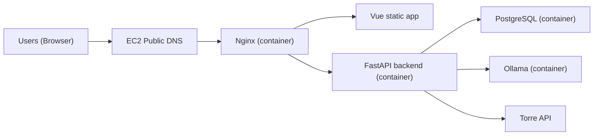

# Simple AWS Deployment Schema (EC2-Only POC)

## Goal
Keep this PoC deployment minimal and low-cost on AWS using:
- one EC2 instance
- one Docker Compose stack
- no Route 53
- EC2 default public DNS

## Architecture

## Runtime Decisions
- `SCREENING_BROKER_URL=""` (in-memory event publisher).
- `SCREENING_OLLAMA_BASE_URL=http://ollama:11434` (Ollama enabled in EC2 stack).
- Postgres is required and runs as a Docker container.
- Keep one backend container for this PoC call flow.

## Compose and Nginx
- Compose file: `docker-compose.ec2.yml`
- HTTPS override: `docker-compose.ec2.https.yml`
- Nginx image/build: `Dockerfile.nginx`
- Nginx routing config: `deploy/nginx/default.conf`
- Nginx HTTPS config: `deploy/nginx/default-https.conf`

Nginx routing:
- `/` serves frontend static files.
- `/api/*` proxies to backend.
- `/api/ws/*` proxies WebSocket traffic to backend.

## Required AWS Setup
1. Launch one EC2 Ubuntu instance (for example `t4g.small` for low-cost PoC).
2. Attach a security group with inbound:
   - `22` (SSH)
   - `80` (HTTP)
   - `443` (HTTPS, if enabled)
3. Install Docker Engine and Docker Compose plugin.
4. Copy code to instance and create `.env.ec2` from `.env.ec2.example`.
5. Start stack:
   - `docker compose --env-file .env.ec2 -f docker-compose.ec2.yml up -d --build`

## Important HTTPS Note
The browser microphone flow requires a secure context in this app. For full call functionality in browser:
- use HTTPS on Nginx (`443`) with a valid certificate, or
- run locally on `localhost` for testing.

To run HTTPS mode with cert files mounted from host:
- `docker compose --env-file .env.ec2 -f docker-compose.ec2.yml -f docker-compose.ec2.https.yml up -d --build`
- set `TLS_CERT_PATH` and `TLS_KEY_PATH` in `.env.ec2`

## CI/CD
Workflow file: `.github/workflows/ec2-cicd.yml`

Pipeline behavior:
1. Run backend unit tests + frontend tests.
2. Deploy runs only on manual workflow trigger after EC2 secrets are configured.
3. Upload release tarball to EC2 over SSH and run `docker compose ... up -d --build`.

Required GitHub secrets:
- `EC2_HOST`
- `EC2_USER`
- `EC2_SSH_KEY`

## Should We Add Terraform?
Included template: `infra/terraform/ec2-minimal`

The template defaults to `t4g.small`, auto-selects `arm64` Ubuntu AMI for `t4g.*`, and auto-picks a subnet/AZ that supports the chosen instance type.

Use Terraform when you want:
- reproducible EC2/security group provisioning
- lower manual setup drift
- fast environment recreation
